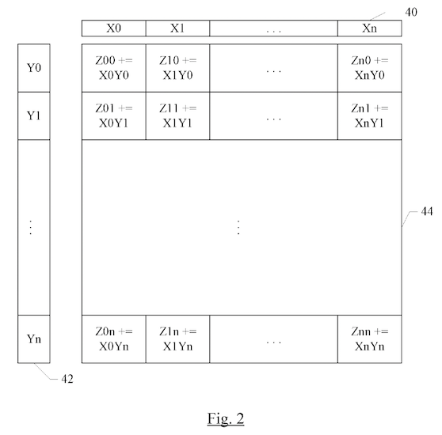

# A brief overview of SME in Apple M4

## SME fundamentals

SME (Scalable Matrix Extension) builds on ARM's SVE (Scalable Vector Extension) and extends it with scalable operations on matrices and sets of vectors. In following, it is assumed that the reader has basic familiarity with SIMD and understands arithmetics surrounding bits and bytes. I will briefly introduce the most important SME concepts in this section. For a more comprehensive overview, please refer to ARM blog post series about SME[^1] [^2].

SME consists of the following architectural state:

- An implementation-defined vector lengh `VL` (bits)
- 32 scalable SIMD vector registers `Z0`-`Z31` (`VL` bits each)
- A two-dimensional tile storage `ZA` (`VL/8` by `VL/8` bytes)

Each vector register can be interpreted as containing `VL/8` byte-sized elements, `VL/16` halfword-sized elements, `VL/32` word-sized elements, and so on. This is common property of SIMD instruction sets.

The vector length `VL` is implementation-defined and its value is only know when the code is executed. This is an essential property of ARM's scalable architecture design. The idea is to enable the development of scalable algorithms, which automatically adapt to the hardware capabilities. SVE includes a number of features to make this possible, such as masks and looping constructs. SME combines the notion of scalability with two-dimensional data storage, adding yet another layer of complexity to the programming model.

To access SME operations, the CPU must be in the streaming SVE (SSVE) mode. This is controlled by `smstart`/`smstop` instructions. The streaming mode has its own implementation defined vector length `VL`. Furthermore, the implementation is free to choose how much of core SVE instructions are supported in the streaming mode. The reason behind this complexity is to permit SME to be implemented via a separate hardware unit (coprocessor). The capabilities of this unit can be different from that of the main CPU core. For example, the SME coprocessor can be optimized for working with large data, favouring compute throughput over latency (best for HPC problems). The main CPU core instead can be optimized for latency and smaller problems (best for general-purpose programming). To add to the confusion, while SME builds on SVE, an implementation is allowed to support SME/SSVE but not SVE. This is the case for Apple M4, which supports SME version 2 (and a subset of SVE) when in streaming mode, but does not support SVE otherwise.

To sum it up, when working with SME, the programmer has to keep the following in mind:

- SME is only available in the streaming (SSVE) mode, which has different performance characteristics and capabilities from the regular SVE mode
- The size of registers and tiles is not known at compile time, dynamic indexing and masking needs to be used to process data
- Switching into the streaming mode makes regular SVE SIMD inaccessible and via versa
- An implementation might support streaming mode SVE, but not regular (non-streaming mode) SVE

## Tile storage ZA and matrix operations

The main motivation for SME is accelerating matrix operations. To facilitate this, SME includes an unusual archtiectural feature — a two-dimensional tile register named `ZA`. The size of this tile is `VL/8` times `VL/8` bytes, making it a rectangle of bytes with each side equal in size to that of the vector registers `z0`-`z31`.

The fundamental matrix operation in SME is the outer product [outer products](https://en.wikipedia.org/wiki/Outer_product) — pairwise multiplication of elements from two input vectors. If each of the input vectors  contains `N` elements, the output of the outer product is an `N×N` matrix. Each row of this matrix is computed by multiplying the corresponding element of the first input vector with the elements of the second input vector. To perform matrix multiplication, we can do a series of outer product (one each for each row and column of input matrices) and add them together. All this is explained in great detail in the ARM blog post series[^2].

Another illustration of outer products is found in an abandoned Apple patent, reproduced above. It is implied that the hardware is organized similarly, with configurable multiply-accumulate units and data paths that can combine vector inputs and produce a matrix of results. SME supports a wide range of data types and combinations, including reduced, single, and double precision floating point and integer data, in addition to specialized data formats such as Brain Floating Point.

The `ZA` storage can be interpreted as an array of `VL`-bit slices (`VA/8` in total), accessed as `ZA[0], ZA[1], ...`. However, since the number of slices is not known beforehand — it depends on the implementation-defined value of `VL` — slices can only be indexed dynamically, using a 16-bit general-purpose register.

Another challenge arises when workign with SME matrices. A vector register always holds `VL` bits, meaning that it will contain `VL/8` 8-bit elements, `V/16` 16-bit sized elements, `V/32` 32-bit sized elements and so on. The result of an outer product is then a rectangular matrix with as many elements to each side. This has the counterintuitive property that the matrix storage gets progressively smaller as the element size gets larger. For example, a a matrix of 8-bit elements requires `VL/8` times `VL/8` bytes — precisely the size of the full `ZA` tile. However, a matrix of 16-bit (2-byte) elements requires `(VL/16)*(VL/16)*2 = 1/2*(VL/8)*(VL/8)` bytes, or half the `ZA` storage size. Similarly, a matrix of 32-bit elements requires one quarter of storage, a matrix of 64-bit elements one eights of `ZA` storage, and so on. To account for this, ARM designers divide the `ZA` storage into typed tiles. There is a single tile containing bytes (`ZA.B`), two tiles containing halfwords (`ZA0.H-ZA1.H`), four tiles containing words (`ZA0.S-ZA3.S`) etc. The relationship between these tiles and the `ZA` storage is well defined — each row of a typed tile corresponds exactly to one array slice in the `ZA` array, adn the rows are interleaved. For example, the tile `ZA0.H` is stored in the even-numbered slices of `ZA` and the tile `ZA1.H` is stored in the odd-numbered slices. See ARM introductory materials for a detailed explanation and illustration[^1] [^3] [^4].

Finally, `ZA` storage can also be accessed as rows and columns of individual typed tiles, or even as groups of slices. SME programming feels like a geometrical puzzle, it gives us a lot of flexibility in reinterpreting and arranging data, and allows for some interesting tricks. For example, first four array slices of `ZA` map to the first row of 32-bit tiles `ZA0.S-ZA3.S`. This means that we can do four matrix operations and then easily concatenate their rows, which is useful for divide-and-conquer matrix multiplication. See the example of SME matrix multiplication from the "SME Programmer's Guide"[^4].

## SME in Apple M4

Apple's matrix accelerator is implemeted as a dedicated hardware coprocessor. There is one such block per CPU cluster. On M4, this means a large SME block in the P-core cluster (shared by the four performance cores) and a smaller SME block in the E-ore cluster (shared by the six efficiency cores). The SME vector length is 512-bits, meaning that each vector register is 64 bytes and the `ZA` tile storage is 4096 bytes. The P-core SME unit can sustain 2TFLOPS of FP32 multiply-accumulate on matrix operations. Assuming a 16×16 arrangement of compute units, this gives us an estimated 3.9Ghz operating frequency, which is very similar to the multi-core frequency of P-cores. The E-core SME is much slower at <ENTER DATA HERE>.

All CPU cores in the cluster access the same SME block and contend for its resources. At the same time, a single core is able to fully saturate local SME resources (if done correctly). Both P- and E-cores must be used in order to reach peak SME throughput of the M4 chip. Multiple threads can provide load balancing and improve performance, if the total data fits within L2 cache.

There is no direct data communication between the CPU cores and the SME coprocessor. The data needs to go through the shared L2 cache using loads and stores on both sides. The only exception to this is control data such as addresses and offsets, which are presumably communicated on a dedicated control bus. The SME coprocessor has a dedicated high-bandwidth connection to the L2 and is able to to fetch and store data at much faster rate than CPU cores.

The SME coprocessor in M4 supports SME version 2 (SME2) and a limited subset of SVE instructions. Following features are supported:

- `FEAT_SME`
- `FEAT_SME2`
- `SME_F32F32` (FP64 outer product)
- `SME_BI32I32`(1-bit binary outer product, see `BMOPA` instruction)
- `SME_B16F32` (BF16 outer product into FP32)
- `SME_F16F32` (FP16 outer product into FP32)
- `SME_I8I32` (I8 outer product into I32)
- `SME_I16I32` (I16 outer product into I32)
- `FEAT_SME_F64F64` (FP64 outer product)
- `FEAT_SME_I16I64` (I8 outer product into I64)

Apple M4 coprocessor supports a wide range of data types, including 8-bit, 16-bit, and 32-bit integers, 16-bit, 32-bit, and 64-bit floating point, as well as 16-bit brain floating point. Not all data type combinations are supported. In particular, f16 is only supported when accumulating to f32, and i16 can only be accumulated to i64. See [M4 SME Outer Product Microbenchmarks](./02-sme-outer-product.md) for a detailed overview.

It is important to note that the M4 CPU cores do not support the regular SVE SIMD extensions. As of M4, SVE registers and intructions are limited strictly for the use with the coprocessor. It is not known whether SVE support is coming to a future Apple Silicon release.

## SME — a leaky astraction

As we will see, Apple's SVE/SME implementation is leaky. In theory, the benefit of a scalable vector/matrix instruction set is that you write an algorithm once and expect it to run on all kinds of future hardware with optimal performance. In practice, hardware can behave in a way that defies expectations.

With SME, there are different ways to achieve the same result, and they are not always equal. For example, the `LDR` instruction can load data into vector registers or straight into the `ZA` tile, but using registers can be considerably faster.

Another example is accelerating vector operations. The base SVE instruction `FMLA` (fused-multiply accumulate, `a = b*c + a`) is supported on M4 SME unit, and seems like an obvious option for working on two long arrays. However, using this instruction only achieves disappointing 31 GFLOPs on FP32 vectors. This is considerably less than what Neon SIMD of a single M4 P-core is capable of. Does this mean that the M4 SME unit is useless for vector operations? Not at all! Using an SME-specific variant of `FMLA` allows us to achieve a much more respectable 250 GFLOPs on FP32 vectors. The crucial difference is that this variant of `FMLA` works with the `ZA` storage as accumulator instead of a vector register.  It seems that — at least on M4 — the execution units are closely associated with the tile storage and SME instructions are required to achieve the best possible performance on the platform. Low-level programmers will encounter these pitfalls when utilizing these new features, and future compliant hardware might behave differently.

[^1]: [Part 1: Arm Scalable Matrix Extension (SME) Introduction](https://community.arm.com/arm-community-blogs/b/architectures-and-processors-blog/posts/arm-scalable-matrix-extension-introduction)
[^2]: [Part 2: Arm Scalable Matrix Extension (SME) Instructions](https://community.arm.com/arm-community-blogs/b/architectures-and-processors-blog/posts/arm-scalable-matrix-extension-introduction-p2)
[^3]: [ARM Architecture Reference Manual](https://developer.arm.com/documentation/ddi0487) sections B1.4.9 - B1.4.12
[^4]: [SME Programmer's Guide](https://developer.arm.com/documentation/109246)
