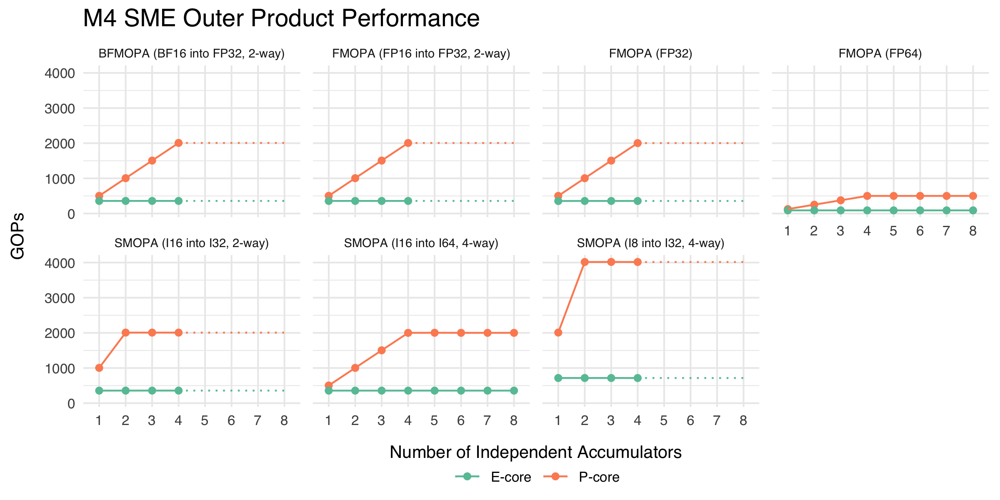
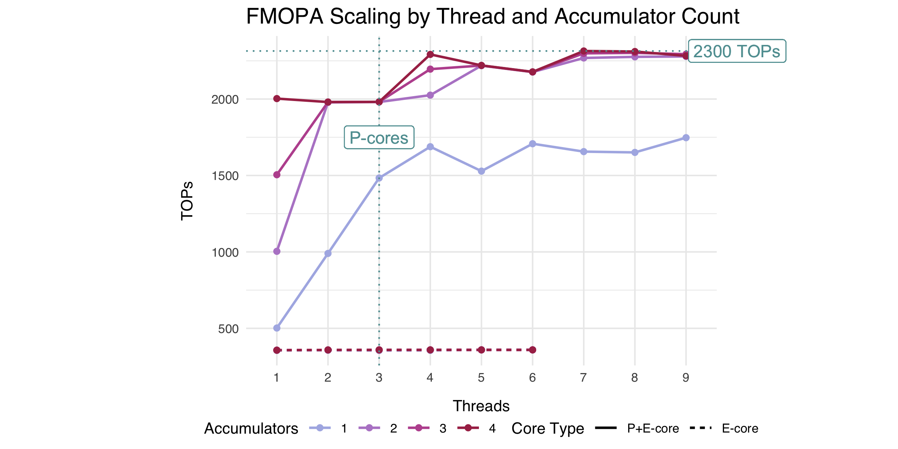

# M4 SME Outer Product


## Outer Product Operations (Matrix Multiplication)

### Overview

An SME outer product instruction multiplies a column vector by a row
vector and accumulates the resulting matrix to ZA storage[^1]. Several
variations of the outer product instructions follow a similar format:

      opcode     ow/colum masks      type suffix 
         |            _____              |
         |           |     |             |
       fmopa za0.s, p0/m, p1/m, z0.s, z1.s
              |                  |     | 
              |                  -------
      ZA accumulator tile     input resisters 

ARM assembly uses type suffixes to indicate the data type and operation,
where b represents 8-bit data, h 16-bit, s 32-bit, and d 64-bit. When
data size alone is insufficient to specify the operation, different
instruction names are used (e.g., fmopa for floating-point outer
products, smopa for signed integer, bfmopa for Brain-float, etc.).
Different data types occupy different amounts of ZA storage; for
example, a FP64 matrix is half the size of an FP32 matrix. SME
partitions ZA storage into typed tiles to represent this in a scalable
fashion[^2]. There are four 32-bit tiles (za0.s-za3.s), eight 64-bit
tiles (za0.d-za7.d), and so on.

SME supports a wide range of data types and their combinations. Here, I
will use type names that commonly used in machine learning, such as
FP32, BF16, I16, I8, and others. Besides regular outer products (e.g.,
FP32 vectors yielding an FP32 matrix), SME also supports “widening”
products. These operations take smaller data types, like I8, and produce
a larger result type, such as I32, hence “widening.” To ensure the
resulting matrix aligns with its type’s tile size, these operations
reduce adjacent values by adding them together. For example, a 16-bit
outer product widened to 32-bit computes the pairwise products of two
adjacent 16-bit elements in each 32-bit input and places the sum in a
single 32-bit matrix cell. This is called 2-way widening. Four-way
widening is also possible, such as computing an outer product of I8
values in an I32 matrix. ARM provides a detailed explanation and
illustrations in their SME blog post[^3].

The Apple M4 chip supports various outer products for floating-point and
integer data, but not all combinations are permitted. For instance,
16-bit floating-point vectors (FP16 and BF16) are only supported as FP32
outer products. Although SME offers an optional extension for 16-bit
matrices, it is unsupported in M4’s feature set on the iPad, as my
attempts to use 16-bit instructions resulted in CPU faults. Similarly,
I8 values can only accumulate into I32 matrices, and I16 values into
either I32 or I64 matrices. Integer outer products without widening are
unsupported. The table below lists the supported outer product
operations, the data types, and peak measured performance (in
giga-operations per second) on P- and E-cores on a 9-core iPad Pro 4.

| kind           | opcode | input | output | P-core (GOPs) | E-core (GOPs) |
|:---------------|:-------|:------|:-------|--------------:|--------------:|
| floating-point | fmopa  | FP32  | FP32   |          2000 |           360 |
| floating-point | fmopa  | FP64  | FP64   |           500 |            90 |
| floating-point | fmopa  | FP16  | FP32   |          2000 |           360 |
| floating-point | bfmopa | BF16  | FP32   |          2000 |           360 |
| integer        | smopa  | I16   | I32    |          2000 |           360 |
| integer        | smopa  | I8    | I32    |          4000 |           700 |
| integer        | smopa  | I16   | I64    |          2000 |           360 |

The M4 iPad can achieve 2 TFLOPs in single-precision or 0.5 TFLOPs in
double-precision matrix multiplication on a single CPU core. While we
might expect faster 16-bit operations, these are capped at the same 2
TFLOPS as the 32-bit outer product, likely because FP16/BF16 operations
are internally treated as FP32 (as discussed below). Low-precision 8-bit
integers offer a slight advantage at 4 TOPs. Given that most ML
accelerators provide optimized performance for lower-precision data
types, this is an area Apple may aim to improve in future iterations.

On E-cores, SME outer products are significantly slower than on P-cores
by a factor of around 5. This is due to both lower clock frequency and,
more critically, the lack of concurrent instruction execution on
E-cores, limiting their peak performance (further discussion below).

### Microbenchmark Methodology

These microbenchmarks aim to determine peak performance for various
operations under specific conditions. Each benchmark involves a repeated
assembly loop of target operations, with performance calculated as the
number of operations per second. Multiply-add operations are counted as
two operations following the established convention. Note that loop
instruction overhead is not accounted for; on an out-of-order CPU like
the Apple M4, loop increments and branches execute concurrently with SME
operations, having negligible latency. Loop unrolling, although
generally beneficial, provided no measurable improvement in this case
and was omitted.

A Python script generates the benchmarks, with operation definitions in
`benchmarks.yaml` and the script in `tools/gen_op_benchmarks.py`. Refer
to these files for more details. Current results include
{filter(benchmark_results, str_detect(category, “Outer Product”)) \|\>
nrow()} microbenchmarks executed for {filter(benchmark_results,
str_detect(category, “Outer Product”)) \|\> pull(label) \|\>
n_distinct()} different outer product instructions. Benchmarks vary in
data-parallel instruction counts and the number of execution threads.

A key variable is the number of data-independent instructions (distinct
accumulators) per loop iteration. Consider the examples below:

``` asm
# data-dependent instructions (ILP = 1)
fmopa z0.s, p0/m, p0/m, z1.s, z2.s
fmopa z0.s, p0/m, p0/m, z1.s, z2.s

# data-independent instructions (ILP = 2)
fmopa z0.s, p0/m, p0/m, z1.s, z2.s
fmopa z1.s, p0/m, p0/m, z1.s, z2.s
```

In the first example, both instructions use the same ZA tile as an
accumulator, creating a data dependency and limiting instruction-level
parallelism (ILP) to 1. In the second example, two different
accumulators are used, allowing concurrent execution if hardware permits
(ILP = 2).

We can determine the hardware’s capabilities by varying ILP and
benchmarking on P- and E-cores. Specifically, we aim to answer:

- How should we use these instructions for optimal performance (e.g.,
  number of accumulators, instruction types)?
- How does multithreading impact SME performance?
- How does mixing operations affect performance?

### Number of Accumulators and Single-Threaded Performance

This test investigates the performance of outer product operations
depending on the number of unique accumulators (data-independent
instructions used per loop). If the hardware has some capability of
executing operations concurrently, we expect that using more
accumulators will improve performance. The single-core benchmark results
for P- and E-cores are summarized in the plot below. Note: instructions
targeting 64-bit data types can have up to 8 independent accumulators
(`za0.d-za7.d`), instructions targeting 32-bit data only four
(`za0.d-za3.d`). The dotted line shows that the maximal number of
accumulators has been reached.



On P-cores, most instructions reach maximum performance with four
accumulators. Integer SMOPA accumulating into I32 tiles require only two
accumulators to achieve peak performance. There was no benefit in using
more than four accumulators with 64-bit data types on Apple M4. These
results highlight the importance of careful algorithm design when
targeting SME-capable processors. A naive algorithm might use a single
accumulator tile for matrix multiplication, severely limiting
performance (see matrix multiplication example in SME Programmer’s Guide
for a more advanced approach[^4]).

It is also clear that the hardware can to execute instructions
concurrently. There are different ways to achieve such execution, for
example by leveraging multiple hardware execution units. However, in the
case of Apple’s SME implementation, the evidence points to [pipelined
execution](https://en.wikipedia.org/wiki/Instruction_pipelining). Each
operation takes multiple steps to execute, and multiple operations can
progress through steps back-to-back, like on a factory conveyor belt. On
Apple Silicon, most outer product operations take four cycles (steps),
but a new operaton can be issued every cycle. This is why the
performance grows linearly with the number of accumulators and peaks at
four — this corresponds to 25%, 50%, 75%, and 100% of pipeline
utilization, respectively. Latency and some scheduling properties of
outer product instructions are discussed in a subsequent section.

Efficiency cores also have an SME unit, but it appears much simpler.
While the performance ratio of various operations remains the same, the
overall performance is much lower than that of P-cores. We also do not
see any evidence of concurrent operation execution. It is unclear
whether the unit merely lacks pipelined execution or whether its design
precludes concurrency entirely. One could speculate that for reasons of
transistor economy the SME unit in the E-core might be much smaller and
execute operations using multiple passes internally.

### Multicore performance

We examine the performance of multithreaded benchmarks varying both the
number of accumulators and threads using FP32 outer product as an
example. The solid line shows performance scaling from one core to a
maximal number of cores available (which is 9 for my iPad Pro). These
threads are launched as priority threads and they will utilize either P-
or E-core based on availability. The dashed vertical line show the
number of performance cores, beyond that line the efficiency cores will
be used as well. Spawning as many threads as there are CPU cores is a
popular strategy for running computations, and we want to see how well
this works for M4 SME code. We can also examine the scaling of E-cores
separately (dashed line).



The graph makes it clear that the SME units are shared by multiple
cores. The maximal rate for FP32 outer products is 2 TOPs, which is
achievable by a single thread using four accumulators or four threads
using one accumulator each (keep in mind that my iPad only has 3
P-cores). It is also apparent that the system can pipeline requests from
multiple cores almost perfectly. There does not appear be a quantitative
difference between running one core with two accumulators or two cores
with a single accumulator. The E-cores, on the other hand, show no
scaling at all, which is in line with the previous results.

SME, as a shared resource, adds an additional layer of complexity to
writing HPC algorithms. While the ability to saturate the SME unit from
a single thread offers flexibility, multithreading remains essential for
balancing workloads and maximizing performance. However, selecting an
optimal threading strategy is challenging. SME is a per-cluster
resource, and to the best of my knowledge, Apple’s APIs currently lack
tools for scheduling threads across different clusters. Launching the
maximum number of threads is possible, but it depends on very large
problem sizes (especially on upcoming many-core Macs), is inefficient,
and risks L2 cache thrashing. Additionally, as shown in the next
section, mixing SME instructions that target different data formats
incurs a performance penalty. Special care must be taken to avoid
running parallel threads that process different types of data, as this
can lead to a significant performance regression.

### Instruction latency and SME hardware implementation details

This section is speculative, as I am thinking out loud about what some
of these results can reveal about the inner workings of the SME unit. I
welcome any discussion and suggestions.

We already saw evidence that the P-core SME unit is pipelined. At 2
TFLOPs of FP32 and 512 FLOP per outer product this translates to the
clock frequency of 2e12/512/sec ≈ 3.9Ghz. This is very close to the
operating frequency of the M4 CPU running multithreaded core, which is
unlikely to be a coincidence. It makes sence that the SME unit would
operate at the same frequency as the rest of the cluster. Knowing the
frequency, we can now measure the latency of the outer product
operations. For this, we measure the time required to execute
data-dependent instructions like these:

``` asm
fmopa z0.s, p0/m, p0/m, z1.s, z2.s
fmopa z0.s, p0/m, p0/m, z1.s, z2.s
```

Several million iterations of this block run at the rate of ~ 0.48
giga-instructions per second. Dividing the frequency by this rate, we
obtain the value of 8 cycles required to run this loop (keep in mind
that the loop is repeated, which means that the sequence of
data-dependent instructions carries on). The resulting instruction
latency of 4 cycles aligns with the same latency measured for Apple’s
NEON vector FMAunits. This further points to the SME execution unit as a
16x16 grid of FMAs.

Below is the latency measured in this way for all outer product
instructions on P-cores.

| Operation 1                    | Latency | GOPs |
|--------------------------------|:-------:|:----:|
| FMOPA (FP32)                   |    4    | 2000 |
| FMOPA (FP64)                   |    4    | 500  |
| FMOPA (FP16 into FP32, 2-way)  |    8    | 2000 |
| BFMOPA (BF16 into FP32, 2-way) |    8    | 2000 |
| SMOPA (I16 into I32, 2-way)    |    4    | 2000 |
| SMOPA (I8 into I32, 4-way)     |    4    | 4000 |
| SMOPA (I16 into I64, 2-way)    |    4    | 2000 |

We see that all operations have a latency of 4 cycles — except 16-bit
widened floating-point outer products, which have a latency of 8 cycles.
I also did some testing using a mix of instructions and have reached the
following conclusions:

- 16-bit floating point MOPA is likely executed as 2x 32-bit MOPA
- There is one cycle penalty for switching between some data paths

Pitfalls of instruction mixing are particularly relevant for
multithreaded processing. Since SME instructions from multiple threads
are executed on a shared SME unit, threads processing different data
types might experience a significant performance regression. Care should
be taken not to mix different SME code in threads that execute in
parallel.

**16-bit floating point MOPA is likely executed as 2x 32-bit MOPA**

It seems odd that 16-bit FP MOPA has a latency of 8 cycles where all
other operations are at 4 cycles. Given that these operations do not
execute any faster than FP32 FMOPA, this might indicate that they are
executed on the FP32 data path using two steps. And indeed, a single
16-bit FP MOPA behaves very similarly to two data-dependent FP32 MOPAs
in microbenchmarks. I have tested various combinations of between two
and four 16-bit and 32-bit FMOPAs in a single loop, and all of them have
the curios property of executing in precisely 8 cycles. This would
indeed be possible if the 16-bit FMOPA is issued twice with a latency of
four cycles. Consider the following example:

``` asm
# 8 cycles
fmopa z0.s, p0/m, p0/m, z1.s, z2.s # A (FP32)
fmopa z1.s, p0/m, p0/m, z1.h, z2.h # B (FP16) 

# issue
cycle   1  2  3 4 5  6 7 8   9 10
instr | A B.0 - - - B1 - - | A B0 
    loop 1               loop 2
```

If instruction B issues as two dependent instructions, B0 and B1, the
distance between them must be at least three cycles (the full pipeline
runs in four cycles). This means the execution has to stall for three
cycles after B0 (to wait for the result before executing B1). However,
the execution mustalso stall after B1 since we go into the next loop,
where B0 is the second instruction. Here we only need to stall for two
cycles, since A can be issued on the third one. This schema results in 2
instructions in 8 cycles.

And it is not difficult to see that this holds for any combination of up
to four instructions. Adding one or two new 16-bit or 32-bit FMOPAs into
the mix will fill up some empty slots but will never reduce the loop
cycle count below eight.

**There is one cycle penalty for switching between some data paths**

Testing sequences between 2 and 4 FP32 and FP64 FMOPAs yields the
following:

``` asm
# 4 cycles
fmopa z0.s, p0/m, p0/m, z1.s, z2.s # A (FP32)
fmopa z1.d, p0/m, p0/m, z1.d, z2.d # B (FP64) 

# 5 cycles
fmopa z0.s, p0/m, p0/m, z1.s, z2.s # A (FP32)
fmopa z1.d, p0/m, p0/m, z1.d, z2.d # B (FP64) 
fmopa z2.d, p0/m, p0/m, z1.d, z2.d # B (FP64) 

# 6 cycles
fmopa z0.s, p0/m, p0/m, z1.s, z2.s # A (FP32)
fmopa z1.d, p0/m, p0/m, z1.d, z2.d # B (FP64) 
fmopa z2.d, p0/m, p0/m, z1.d, z2.d # B (FP64) 
fmopa z3.d, p0/m, p0/m, z1.d, z2.d # B (FP64) 
```

This result is stable, no matter how one mixes the instructions. A
reasonable explanation is that switching between data types requires one
additional cycle. This adds two additional cycles to the loop.

Similar interactions exist between some other instructions. However,
mixing I8-\>I32 SMOPA and I16-\>I64 SMOPA results in a higher penalty of
extra 3 cycles. I will update this section once I investigate this in
more detail.

## References

[^1]: [Part 1: Arm Scalable Matrix Extension (SME)
    Introduction](https://community.arm.com/arm-community-blogs/b/architectures-and-processors-blog/posts/arm-scalable-matrix-extension-introduction)

[^2]: [Part 2: Arm Scalable Matrix Extension (SME)
    Instructions](https://community.arm.com/arm-community-blogs/b/architectures-and-processors-blog/posts/arm-scalable-matrix-extension-introduction-p2)

[^3]: [Part 2: Arm Scalable Matrix Extension (SME)
    Instructions](https://community.arm.com/arm-community-blogs/b/architectures-and-processors-blog/posts/arm-scalable-matrix-extension-introduction-p2)

[^4]: [SME Programmer’s
    Guide](https://developer.arm.com/documentation/109246)
